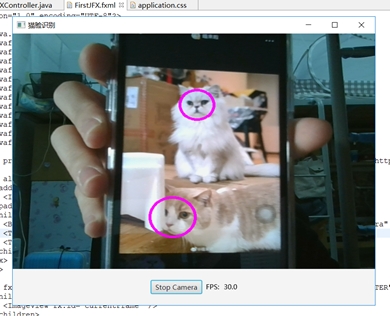
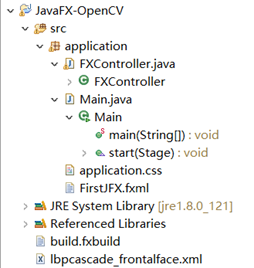
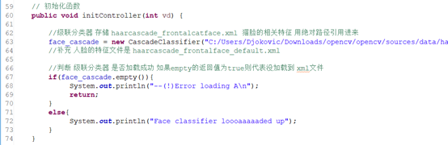
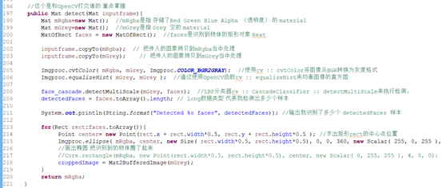

# 基于 OpenCV 图像处理的猫脸识别应用

OpenCV 是近年来最受欢迎的计算机视觉应用库。在其基础上编写图像处理代码效率会有效提高。我这次设计的项目通过使用 OpenCV 进行一个"猫脸识别"的应用场景，探讨计算机视觉应用在模式识别和图象识别领域的综合运用。项目本身使用了 JavaFX 来构造用户操作界面，方便值观的展示出应用场景。同时基于 OpenCV 的 Java 库函数和特征库实现其中核心的识别算法。（OpenCV、JavaFX、猫脸识别）

## 系统应用实例-启动状态

## 系统应用实例-待机状态
  
   
## 系统架构设计

### 系统界面调用方式

### 系统识别文件加载方式
  
   
### 系统猫脸识别核心代码

## 系统设计总结 
本次实现猫脸识别应用，对猫的脸部识别所需要的面部特征并分析其有效性，最终实现出基于 OpenCV 图像处理的猫脸识别应用。在这次项目运用过程中，对 OpenCV 库进行了文档查阅和相关知识的学习，对JavaFX的知识进行了课外的拓展和了解，对 Eclipse 编程软件的使用方法有了新的认识。学会了 Java 编程当中模块化使用代码和第三方库函数的方法，能灵活处理一些调用代码事遇到的问题和阻碍。  
